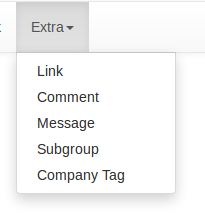

# Admin Interface
CRM application depends heavily on [Flask-Admin](http://flask-admin.readthedocs.io/) excellent admin dashboard to build consistent admin interface on top of its data models. 


## Conventions
CRM package already consists of applications packages like contact, company, ..etc. Each provides `graphql.py`  to define resolvers and mutations related to that application, and `models.py` file which gets rendered in the admin panel

### Navbar

We have 2 menus
 - main menu: for frequently accessed models (companies, contacts, users, ..etc) 
 - extra menu: for models we don't interact with very often. 

The order of the items is customizable from the admin application `config.py`
```python
NAV_BAR_ORDER = {
    'MAIN':  ["User", "Company", "Contact", "Organization", "Deal", "Project", "Sprint", "Task"],
    'EXTRA': ["Link", "Comment", "Message", "Subgroup", "CompanyTag"],
}
```

### Mixins
All of the models support AdminLinksView Mixin to have simple links to their admin views.

### Views
Views are defined in admin application views.py file.
We have consistent views (CreateView, EditView, IndexView, DetailsView) thanks to flask-admin.

#### EnhancedModelView
EnhancedModelView is the base class for all of the views in the admin interface

```python
class EnhancedModelView(ModelView):
    can_view_details = True
    column_formatters = column_formatters
    model_form_converter = CustomAdminConverter
    mainfilter = ""

    ...
```
It allows to show the details page, and setting formatters to crm defined formatters and custom converters used to handle sqlalchemy enums in model forms.


#### How to create a view
We will use the UserModelView as an example here

```python

class UserModelView(EnhancedModelView):
    column_list = ('firstname', 'lastname', 'username', 'emails',
                   'telephones',)

    column_sortable_list = ('firstname', 'lastname', 'username')
    column_searchable_list = ('firstname', 'lastname', 'username')


    column_details_list = (
        'firstname', 'lastname', 'username', 'emails', 'telephones', 'description', 'message_channels',
        'ownsContacts', 'ownsTasks', 'tasks', 'ownsAsBackupContacts', 'ownsCompanies', 'ownsAsBackupCompanies',
        'ownsOrganizations', 'ownsSprints', 'promoterProjects', 'guardianProjects', 'comments', 'messages', 'links', 'author_last', 'author_original', 'updated_at')

    form_rules = (
        'firstname', 'lastname', 'username', 'emails', 'telephones', 'description', 'message_channels',)


    column_filters = ('firstname', 'lastname',
                      'username', 'ownsTasks',)
    form_edit_rules = ('firstname', 'lastname', 'username', 'description',
                       'emails', 'telephones', 'message_channels', 'ownsTasks', 'tasks', 'messages', 'comments', 'links')


    inline_models = [
        (TaskModel, {'form_columns': [
            'id', 'title', 'description', 'type', 'priority', 'assignee']}),
        (MessageModel, {'form_columns': [
            'id', 'title', 'content', 'channel']}),
        (CommentModel, {'form_columns': ['id', 'content']}),
        (LinkModel, {'form_columns': [
            'id', 'url', ]}),
    ]
    mainfilter = "Users / Id"

```
- All model views should inherit from `EnhancedModelView` class
- ListView is the entry point of the model view that lists all the objects. 
    and we define the columns displayed using class attribute `column_list`, searchable fields using `column_searchable_list`, and the sortable columns using `column_sortable_list`
    ```python
        column_list = ('firstname', 'lastname', 'username', 'emails',
                   'telephones',)
        column_sortable_list = ('firstname', 'lastname', 'username')
        column_searchable_list = ('firstname', 'lastname', 'username')
    ```
    Also you can filter the displayed objects according to certain filters you define in `column_filters` class attribute 
    ```python
        column_filters = ('firstname', 'lastname', 'username', 'ownsTasks',)
    ```
    > mainfilter attribute is used to link to other models in the detailsview (make sure to define it if you want to have linkable fields.)

- DetailsView is used when we want to see all the details of specific objects 
    The fields we want to show in the details view should be specified in `column_details_list`
    ```python

    column_details_list = (
        'firstname', 'lastname', 'username', 'emails', 'telephones', 'description', 'message_channels',
        'ownsContacts', 'ownsTasks', 'tasks', 'ownsAsBackupContacts', 'ownsCompanies', 'ownsAsBackupCompanies',
        'ownsOrganizations', 'ownsSprints', 'promoterProjects', 'guardianProjects', 'comments', 'messages', 'links', 'author_last', 'author_original', 'updated_at')
    ```
- CreateView shows a form to create a new object with predefined set of fields that's defined with `form_rules` class attribute. 
    ```python
        form_rules = (
        'firstname', 'lastname', 'username', 'emails', 'telephones', 'description', 'message_channels',)
    ```
- EditView shows a form to edit an existing object with predefined set of fields that's defined with `form_edit_rules` class attribute. 
    ```python
        form_rules = (
        'firstname', 'lastname', 'username', 'emails', 'telephones', 'description', 'message_channels',)
    ```

#### Admin templates
Are defined under `admin/templates` directory with minimum customization as possible.
##### Tabular forms behavior
Flask-admin doesn't provide a way to control the inline forms looks it'll always be stacked. That's why we overrided `inline_form.html` to use our custom macro to render tabular fields
```python



<div class="inline-form-field">

  {{ extralib.render_tabular_form_fields(field.form, form_opts=form_opts) }}
</div>

```


#### Formatters 
Formatters are defined in `admin/formatters.py` which controls how attributes are formatted across the application 

##### Examples
To format markdown
```
def format_markdown(view, context, model, name):
    value = getattr(model, name)
    if value:
        return markdown(value)
    return value
```

and to register it on fields like `bio, description, ..etc`
```
column_formatters = {**column_formatters, **
                     dict(list(zip(["description", "bio", "belief_statement", "content"], cycle([format_markdown]))))}
```