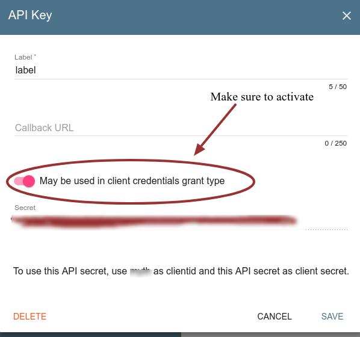

# Accessing Graphql API using HTTP client

- Our end point where Graphql API is exposed is ```/api```
- We have the following constraints on users who can access CRM graphql API on production
    - API users Must be users of ```threefold.crm_users``` organization on [IYO](https://itsyou.online) or users of sub organizations of  ```threefold.crm_users```

- ```/api``` expects the following headers:
    - ```Content-Type:Application/json```
    - ```Authorization: bearer {your-jwt-token}``` replace ```your-jwt-token``` with your actual token

- If you want to use the API directly **without bothering about authentication** nor [IYO](https://itsyou.online) during Development mode or testing
    - *Disable the ```authenticate``` middleware or comment it out totally in the module ```middlewares.py```*
    - *Don't send Authentication headers in your requests*

- **How to get a JWT token from [IYO](https://itsyou.online)**

    - Assuming you created a sub organization from [IYO](https://itsyou.online) ```threefold.crm_users``` organization
    - Get A ```client ID```  & ```Client Secret``` for your organization
        - Go to your organization settings and choose ```API access keys``` then click on (ADD)

            

        - Then make sure your added key allows non UI clients

            
        - Now here's the code snippet to get JWT-Token

            ```python
            import requests
            import urllib

            host = "https://itsyou.online"
            params = {
                'grant_type': 'client_credentials',
                'client_id': 'YOUR-CLIENT-ID', # replace with actual value
                'client_secret': 'YOUR-CLIENT-SECRET' # replace with actual value
            }

            url = '%s/v1/oauth/access_token?%s' % (host, urllib.parse.urlencode(params))

            response = requests.post(url,  verify=False)

            assert(response.status_code == 200)

            result = response.json()

            access_token = result['access_token']

            # Now Getting JWT
            url = '%s/v1/oauth/jwt' % host

            headers = {'Authorization': 'token %s' % access_token}

            data = {'scope': 'user:memberOf:%s' % "simple_crm.crm_users"}

            response = requests.post(
                url,
                json=data,
                headers=headers,
                verify=False)

            assert(response.status_code == 200)

            jwt = response.content.decode()
            ```

# Using the HTTP client


### Python

- **Example on a mutation (Adding contacts)**
    - Example on errors
        ```python
        import requests

        create_contact_mutation = """
            mutation{
                     createContacts(records: [{first_name: "john", emails:"a@s.com", telephones: "01228934568"}, {firstname: "peter", emails:"b2e@.com", telephones: "01228934562"}]){
                         ok
                         ids
                     }
         }
         """
        payload = {'query':create_contact_mutation}
        headers = {'Content-Type':'application/json', 'Authorization': 'bearer your-jwt-token'} # replace 'your-jwt-token' with actual token
        data = requests.post('http://127.0.0.1:5000/api', json=payload, headers=headers)

        data.ok # False

        data.json()

        # Result looks like
        {'errors': ['Argument "records" has invalid value [{first_name: "john", emails: "a@s.com", telephones: "01228934568"}, {firstname: "peter", emails: "b2e@.com", telephones: "01228934562"}].\nIn element #0: In field "first_name": Unknown field.\nIn element #0: In field "firstname": Expected "String!", found null.']}
        ```
    - Example on success
        ```python

        import requests

        create_contact_mutation = """
            mutation{
                     createContacts(records: [{firstname: "john", emails:"a@s.com", telephones: "01228934568"}, {firstname: "peter", emails:"b2e@.com", telephones: "01228934562"}]){
                         ok
                         ids
                     }
            }
            """

        payload = {'query':create_contact_mutation}
        headers = {'Content-Type':'application/json', 'Authorization': 'bearer your-jwt-token'} # replace 'your-jwt-token' with actual token
        data = requests.post('http://127.0.0.1:5000/api', json=payload, headers=headers)

        data.ok # True
        data.json()

        {'ids': ['isudb', 'g3nkl'], 'ok': True}

        ```

- **Example on a mutation (Updating contacts)**

        ```python

        import requests

        create_contact_mutation = """
            mutation{
                     updateContacts(records: [{uid: "isudb", firstname: "BigJohn"}, {uid: "g3nkl", firstname: "BigPeter"}]){
                         ok
                         ids
                     }
            }
            """

        payload = {'query':create_contact_mutation}
        headers = {'Content-Type':'application/json', 'Authorization': 'bearer your-jwt-token'} # replace 'your-jwt-token' with actual token
        data = requests.post('http://127.0.0.1:5000/api', json=payload, headers=headers)

        data.ok # True
        data.json()

        {'ids': ['isudb', 'g3nkl'], 'ok': True}
        ```

- **Example on a mutation (Deleting contacts)**

        ```python

        import requests

        create_contact_mutation = """
            mutation{
                     deleteContacts(uids: ["isudb", "g3nkl"]){
                         ok
                     }
            }
            """

        payload = {'query':create_contact_mutation}
        headers = {'Content-Type':'application/json', 'Authorization': 'bearer your-jwt-token'} # replace 'your-jwt-token' with actual token
        data = requests.post('http://127.0.0.1:5000/api', json=payload, headers=headers)

        data.ok # True
        data.json()

        {'ok': True}
        ```


- **Examples on a queries**

     ```python
        import requests

        query = """
            {
                contacts(first: 3){
                    edges{
                        nodes{
                            firstname
                            lastname
                            uid
                        }
                    }
                 }
            }"""


        payload = {'query':query}
        headers = {'Content-Type':'application/json', 'Authorization': 'bearer your-jwt-token'} # replace 'your-jwt-token' with actual token
        data = requests.post('http://127.0.0.1:5000/api', json=payload, headers=headers)

        data.ok # True
        data.json()

        {
        'items': [
                    {'firstname': 'fathy', 'lastname': '', 'uid': 'qkted'},
                    {'firstname': 'fathy3', 'lastname': '', 'uid': '0urxf'},
                    {'firstname': 'fathy4', 'lastname': '', 'uid': '3yfbt'}

                 ]
         }
     ```


     ```python
        import requests

        query = """
            {
                contacts{
                    edges{
                      node{
                        firstname
                        lastname
                        uid
                      }
                     cursor
                    }
                     pageInfo{
                         hasNextPage
                         hasPreviousPage
                         startCursor
                         endCursor
                     }
                  }
                }
        """

        payload = {'query':query}
        headers = {'Content-Type':'application/json', 'Authorization': 'bearer your-jwt-token'} # replace 'your-jwt-token' with actual token
        data = requests.post('http://127.0.0.1:5000/api', json=payload, headers=headers)

        data.ok # True
        data.json()

        {
            'items': [
                    {
                        'cursor': 'YXJyYXljb25uZWN0aW9uOjA=',
                        'firstname': 'fathy',
                        'lastname': '',
                        'uid': 'qkted'
                    },

                    {
                        'cursor': 'YXJyYXljb25uZWN0aW9uOjE=',
                        'firstname': 'fathy3',
                        'lastname': '',
                        'uid': '0urxf'
                    },
                    {
                        'cursor': 'YXJyYXljb25uZWN0aW9uOjI=',
                        'firstname': 'fathy4',
                        'lastname': '',
                        'uid': '3yfbt'
                    },
                    ....
                    ....
            ]

            'page_info': {
                'endCursor': 'YXJyYXljb25uZWN0aW9uOjE3',
                'hasNextPage': False,
                'hasPreviousPage': False,
                'startCursor': 'YXJyYXljb25uZWN0aW9uOjA='
             }
         }

     ```


     ```python
        import requests

        query = """
            {
                contact(uid: "qkted"){
                    firstname
                    lastname
                    uid
                 }
            }"""


        payload = {'query':query}
        headers = {'Content-Type':'application/json', 'Authorization': 'bearer your-jwt-token'} # replace 'your-jwt-token' with actual token
        data = requests.post('http://127.0.0.1:5000/api', json=payload, headers=headers)

        data.ok # True
        data.json()

        {'firstname': 'fathy', 'lastname': '', 'uid': 'qkted'}
     ```


     ```python
        import requests

        query = """
            {
                contact(uid: "non-existent-uid"){
                    firstname
                    lastname
                    uid
                 }
            }"""


        payload = {'query':query}
        headers = {'Content-Type':'application/json', 'Authorization': 'bearer your-jwt-token'} # replace 'your-jwt-token' with actual token
        data = requests.post('http://127.0.0.1:5000/api', json=payload, headers=headers)

        data.ok # False
        data.status_code # 404
     ```
