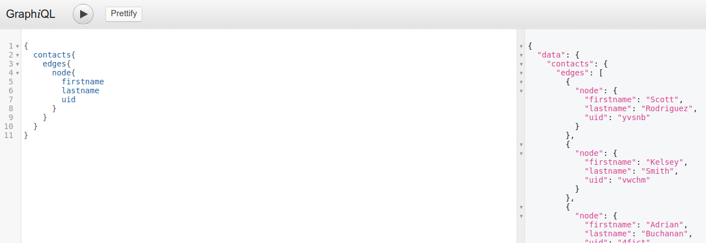

## Graphql Overivew

### Intro
- You may need to have basic understanding of [Graphql](http://graphql.org/learn/) before you go further
- [Graphene](http://docs.graphene-python.org) adds support for [Graphql](http://graphql.org/learn/) in python
- You may need to read this section [Graphql Flask/SqAlchemy](http://docs.graphene-python.org/projects/sqlalchemy/en/latest/tutorial/#creating-graphql-and-graphiql-views-in-flask)


### CRM Graphql API endpoints

- You can test graphql queries through the UI interface at the end point url ```/graphql```

- The web interface is amazing and supports autocompletion for arguments and query structure, even model field names
- using any HTTP client you also send requests to the end point url ```/api```

### CRM Graphql API General Overview

- In [Graphql](http://graphql.org/learn/) API is divided into 2 categories:
    - Queries (To Query Data)
    - Mutations (Manipulate Data) / (CRUD operations)

- Our API end points is divided is also divided into the same 2 main categories (for each DB model)
    - Queries
        - Get ALl Records of certain model.
        - Filter Subset of Records based on some conditions
        - Get one record using its id
    - Mutations
        - Update
        - Delete
        - Create
        - Other custom actions depending on the DB model used; i.e a
        user may have ```add_task``` action exposed that may/may not exposed
        elsewhere

- The query API is kinda look the same for all models
    - we have plural queries ```contacts, deals, ...``` to get all records in these models or subset of them based on some condition
    - we have singular queries ```contact, deal, ...``` to get one record of these models and they take ```uid``` argument which is the ```object id```

- Mutations API is mostly similar for all models but partially different in some cases
    - create operations are named like  ```create_contact, create_deal, ...```
    - update operations are named like  ```update_contact, update_deal, ...```
    - delete operations are named like  ```delete_contact, delete_deal, ...```
    - custom operations for each model and documented our [API page](GraphqlAPI.md)


### Important
- [Graphene](http://docs.graphene-python.org) by default assign an (id) field to each record returned
in a query which is unique internal representation of the record, but this introduces a problem
to us, because this hides the original (id) field coming from DB.
To overcome this **we refer to the original id field with (uid) in our queries and mutations***

